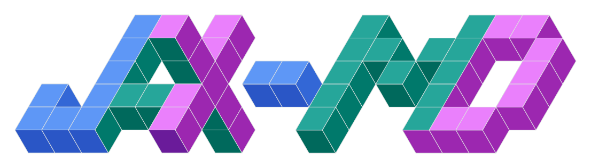

<div align="center">


### Accelerated, Differentiable, Molecular Dynamics
</div>

[**Quickstart**](#getting-started) | [**Installation**](#installation) | [**Reference docs**](https://jax-md.readthedocs.io/en/main/) | [**Paper**](https://arxiv.org/pdf/1912.04232.pdf) | [**NeurIPS 2020**](https://neurips.cc/virtual/2020/public/poster_83d3d4b6c9579515e1679aca8cbc8033.html)

[](https://github.com/jax-md/jax-md/actions/workflows/build.yml)  [](https://pypi.org/project/jax-md/) [](https://github.com/google/jax-md/blob/main/LICENSE)

Molecular dynamics is a workhorse of modern computational condensed matter physics. It is frequently used to simulate materials to observe how small scale interactions can give rise to complex large-scale phenomenology. Most molecular dynamics packages (e.g. HOOMD Blue or LAMMPS) are complicated, specialized pieces of code that are many thousands of lines long. They typically involve significant code duplication to allow for running simulations on CPU and GPU. Additionally, large amounts of code is often devoted to taking derivatives of quantities to compute functions of interest (e.g. gradients of energies to compute forces).

However, recent work in machine learning has led to significant software developments that might make it possible to write more concise molecular dynamics simulations that offer a range of benefits. Here we target JAX, which allows us to write python code that gets compiled to XLA and allows us to run on CPU, GPU, or TPU. Moreover, JAX allows us to take derivatives of python code. Thus, not only is this molecular dynamics simulation automatically hardware accelerated, it is also __end-to-end__ differentiable. This should allow for some interesting experiments that we're excited to explore.

JAX, MD is a research project that is currently under development. Expect sharp edges and possibly some API breaking changes as we continue to support a broader set of simulations. JAX MD is a functional and data driven library. Data is stored in arrays or tuples of arrays and functions transform data from one state to another.

## Getting Started

For a video introducing JAX MD along with a [demo](https://colab.research.google.com/github/google/jax-md/blob/main/notebooks/talk_demo.ipynb), check out this talk from the Physics meets Machine Learning series:

[](https://www.youtube.com/watch?v=Bkm8tGET7-w)

To get started playing around with JAX MD check out the following colab notebooks on Google Cloud without needing to install anything. For a very simple introduction, I would recommend the Minimization example. For an example of a bunch of the features of JAX MD, check out the JAX MD cookbook.

- [JAX MD Cookbook](https://colab.research.google.com/github/google/jax-md/blob/main/notebooks/jax_md_cookbook.ipynb)
- [Custom Potentials](https://colab.research.google.com/github/google/jax-md/blob/main/notebooks/customizing_potentials_cookbook.ipynb)
- [Flocking](https://colab.research.google.com/github/google/jax-md/blob/main/notebooks/flocking.ipynb)
- [Meta Optimization](https://colab.research.google.com/github/google/jax-md/blob/main/notebooks/meta_optimization.ipynb)
- [Swap Monte Carlo (Cargese Summer School)](https://colab.research.google.com/github/google/jax-md/blob/main/notebooks/cargese_swap_mc.ipynb)
- [Implicit Differentiation](https://colab.research.google.com/github/google/jax-md/blob/main/notebooks/implicit_differentiation.ipynb)
- [Athermal Linear Elasticity](https://colab.research.google.com/github/google/jax-md/blob/main/notebooks/athermal_linear_elasticity.ipynb)
- [Smash a Sand Castle](https://colab.research.google.com/github/google/jax-md/blob/main/notebooks/sand_castle.ipynb)

JAX MD also comes with self contained python scripts which you run locally if you have JAX MD installed:

- [Fire minimization](examples/fire_minimization.py)
- [NVE Simulation](examples/nve_simulation.py)
- [NVT Simulation](examples/nvt_simulation.py)
- [NPT Simulation](examples/npt_simulation.py)
- [NVE with Neighbor Lists](examples/nve_neighbor_list.py)
- [Neural Network Potentials](examples/neural_networks.py)

See [FEATURES.md](https://github.com/jax-md/jax-md/blob/main/FEATURES.md) for a tour of the main library components.

## Installation

### With uv

We recommend using [uv](https://docs.astral.sh/uv/) for local development:

```sh
git clone https://github.com/jax-md/jax-md
cd jax-md
uv sync --no-default-groups
```

To include testing and documentation dependencies:

```sh
uv sync --no-default-groups --group testing --group docs
```

### With pip

If you want to use pip instead, install the latest published release with:

```sh
python -m pip install jax-md --upgrade
```

Or install a local source checkout:

```sh
python -m pip install -e .
```

To include testing and documentation dependencies with pip, using the `--group` flag from pip 25.1 or newer:

```sh
python -m pip install -e . --group testing --group docs
```

## Development

JAX MD is under active development. Please don't hesitate to open feature requests to help us guide development. We more than welcome contributions! See [CONTRIBUTING.md](CONTRIBUTING.md) for how to get set up.

## Tests

Tests live in `tests/` and run in double precision:

Run the full suite with uv:

```sh
JAX_ENABLE_X64=1 uv run --no-sync pytest
```

Run a specific test suite with uv:

```sh
JAX_ENABLE_X64=1 uv run --no-sync pytest tests/<suite>_test.py
```

Without uv, install the testing dependencies and run pytest directly:

```sh
python -m pip install -e . --group testing
JAX_ENABLE_X64=1 python -m pytest
JAX_ENABLE_X64=1 python -m pytest tests/<suite>_test.py
```

Run the suites affected by your change. See [CONTRIBUTING.md](CONTRIBUTING.md)
for the full development setup.

## Technical gotchas

### GPU

You must follow [JAX's](https://www.github.com/google/jax/) GPU installation instructions to enable GPU support.

### 64-bit precision
To enable 64-bit precision, set the respective JAX flag _before_ importing `jax_md` (see the JAX [guide](https://colab.research.google.com/github/google/jax/blob/main/notebooks/Common_Gotchas_in_JAX.ipynb#scrollTo=YTktlwTTMgFl)), for example:

```python
import jax
jax.config.update("jax_enable_x64", True)
```

## Publications

JAX MD has been used in the following publications. If you don't see your paper on the list, but you used JAX MD let us know and we'll add it to the list!

1. [Molecular Simulations with a Pretrained Neural Network and Universal Pairwise Force Fields. (J. Am. Chem. Soc. 2025)](https://doi.org/10.1021/jacs.5c09558)<br> A. Kabylda, J. T. Frank, S. Suárez-Dou, A. Khabibrakhmanov, L. Medrano Sandonas, O. T. Unke, S. Chmiela, K.-R. Müller, and A. Tkatchenko
2. [Designing precise dynamical steady states in disordered networks. (Machine Learning: Science and Technology (2025))](https://iopscience.iop.org/article/10.1088/2632-2153/ade590/meta)<br> M. Berneman and D. Hexner
3. [Generalized design of sequence-ensemble-function relationships for intrinsically disordered proteins](https://www.biorxiv.org/content/10.1101/2024.10.10.617695v1)<br> R. K. Krueger, M. P. Brenner, and K. Shrinivas
4. [Tuning colloidal reactions. (PRL 2024)](https://arxiv.org/abs/2312.07798v2)<br> R. K. Krueger, E. M. King, and M. P. Brenner
5. [Programming patchy particles for materials assembly design. (PNAS 2024)](https://www.pnas.org/doi/abs/10.1073/pnas.2311891121)<br> E. M. King, CX. Du, QZ. Zhu, S. S. Schoenholz, and M. P. Brenner
6. [LATTE: an atomic environment descriptor based on Cartesian tensor contractions. (arXiv 2024)](https://arxiv.org/abs/2405.08137)<br> F. Pellegrini, S. Gironcoli, E. Küçükbenli
7. [PySAGES: flexible, advanced sampling methods accelerated with GPUs. (npj Computational Materials 2024)](https://www.nature.com/articles/s41524-023-01189-z)<br> P. F. Zubieta Rico, et al.
8. [Scaling deep learning for materials discovery (Nature 2023)](https://www.nature.com/articles/s41586-023-06735-9)<br> A. Merchant, et al.
9. [LapTrack: linear assignment particle tracking with tunable metrics. (Bioinformatics 2023)](https://doi.org/10.1093/bioinformatics/btac799)<br> Yohsuke T Fukai and Kyogo Kawaguchi
10. [A Differentiable Neural-Network Force Field for Ionic Liquids. (J. Chem. Inf. Model. 2022)](https://pubs.acs.org/doi/abs/10.1021/acs.jcim.1c01380)<br> H. Montes-Campos, J. Carrete, S. Bichelmaier, L. M. Varela, and G. K. H. Madsen
11. [Correlation Tracking: Using simulations to interpolate highly correlated particle tracks. (Phys. Rev. E. 2022)](https://journals.aps.org/pre/abstract/10.1103/PhysRevE.105.044608?ft=1)<br> E. M. King, Z. Wang, D. A. Weitz, F. Spaepen, and M. P. Brenner
12. [Optimal Control of Nonequilibrium Systems Through Automatic Differentiation.](https://arxiv.org/abs/2201.00098)<br> M. C. Engel, J. A. Smith, and M. P. Brenner
13. [Graph Neural Networks Accelerated Molecular Dynamics. (J. Chem. Phys. 2022)](https://aip.scitation.org/doi/10.1063/5.0083060)<br> Z. Li, K. Meidani, P. Yadav, and A. B. Farimani
14. [Gradients are Not All You Need.](https://arxiv.org/abs/2111.05803)<br> L. Metz, C. D. Freeman, S. S. Schoenholz, and T. Kachman
15. [Lagrangian Neural Network with Differential Symmetries and Relational Inductive Bias.](https://arxiv.org/abs/2110.03266)<br> R. Bhattoo, S. Ranu, and N. M. A. Krishnan
16. [Efficient and Modular Implicit Differentiation.](https://arxiv.org/abs/2105.15183)<br> M. Blondel, Q. Berthet, M. Cuturi, R. Frostig, S. Hoyer, F. Llinares-López, F. Pedregosa, and J.-P. Vert
17. [Learning neural network potentials from experimental data via Differentiable Trajectory Reweighting.<br>(Nature Communications 2021)](https://www.nature.com/articles/s41467-021-27241-4)<br> S. Thaler and J. Zavadlav
18. [Learn2Hop: Learned Optimization on Rough Landscapes. (ICML 2021)](http://proceedings.mlr.press/v139/merchant21a.html)<br> A. Merchant, L. Metz, S. S. Schoenholz, and E. D. Cubuk
19. [Designing self-assembling kinetics with differentiable statistical physics models. (PNAS 2021)](https://www.pnas.org/content/118/10/e2024083118.short)<br> C. P. Goodrich, E. M. King, S. S. Schoenholz, E. D. Cubuk, and  M. P. Brenner

## Citation

If you use the code in a publication, please cite the repo using the .bib,

```
@inproceedings{jaxmd2020,
 author = {Schoenholz, Samuel S. and Cubuk, Ekin D.},
 booktitle = {Advances in Neural Information Processing Systems},
 publisher = {Curran Associates, Inc.},
 title = {JAX M.D. A Framework for Differentiable Physics},
 url = {https://papers.nips.cc/paper/2020/file/83d3d4b6c9579515e1679aca8cbc8033-Paper.pdf},
 volume = {33},
 year = {2020}
}
```

If you use functionalities related to `RigidBody`, please cite the following paper using the .bib,
```
@article{king2024programming,
  title={Programming patchy particles for materials assembly design},
  author={King, Ella M and Du, Chrisy Xiyu and Zhu, Qian-Ze and Schoenholz, Samuel S and Brenner, Michael P},
  journal={Proceedings of the National Academy of Sciences},
  volume={121},
  number={27},
  pages={e2311891121},
  year={2024},
  publisher={National Academy of Sciences}
}
```
